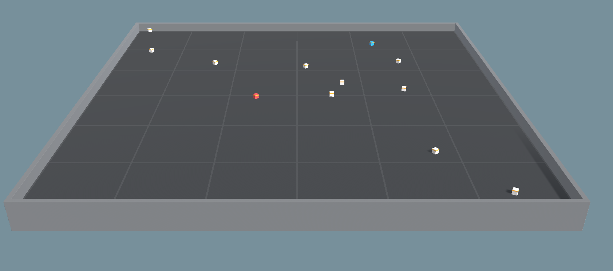

# Pandemic Simulation
Pandemic Simulation with Reinforcement Learning 

## Getting Started

This is an open source pandemic simulation environment for reinforcement learning created with Unity ml-agents. This is a dissertation project for Advanced Computer Science Master in University of Sussex.

Open the "Project" folder in Pandemic_Simulation\ml-agents-release_3\ml-agents-release_3\Project with Unity Editor.
Play Assets/PandemicSimulation/Scenes/T1.unity


### Prerequisites
This project uses Unity-ml-agent 1.1.0 Release 3
Unity 2919.4.0f1
Anaconda Environment with Python 3.7
Tensorflow 2.2.0


### Installing

A step by step series of examples that tell you how to get a development env running

To train an agent:
* Go to the folder of trainer_config.yaml
* Activate the environment
* Start Training

### Training: 

`mlagents-learn` is the main training utility provided by the ML-Agents Toolkit.
It accepts a number of CLI options in addition to a YAML configuration file that
contains all the configurations and hyperparameters to be used during training.
The set of configurations and hyperparameters to include in this file depend on
the agents in your environment and the specific training method you wish to
utilize. Keep in mind that the hyperparameter values can have a big impact on
the training performance (i.e. your agent's ability to learn a policy that
solves the task). In this page, we will review all the hyperparameters for all
training methods and provide guidelines and advice on their values.

To view a description of all the CLI options accepted by `mlagents-learn`, use
the `--help`:

```sh
mlagents-learn --help
```

The basic command for training is:
```
mlagents-learn ./trainer_config.yaml --run-id first_run
```

To see the results use:

```
tensorboard --logdir results
```
This will open a localhost where you can see all the graphs that ml-agents provide to you

## Screenshots from the simulation:
Simulating how infection spreads



States of agents: Represents the SIR Model which is used for visualizing pandemic disease.


## Authors

* **Ege Hosgungor** - *Initial work* - [Hsgngr](https://github.com/Hsgngr)

See also the list of [contributors](https://github.com/your/project/contributors) who participated in this project.


## Acknowledgments

### Inspiration
This project is inspired from followings:
#### Coronavirus Related
* [Corona Simulator](https://www.washingtonpost.com/graphics/2020/world/corona-simulator/)
* [Simulating an epidemic](https://www.youtube.com/watch?v=gxAaO2rsdIs)

#### Unity Ml Agents Related
* [Unity ML Agents Penguins Tutorial](https://connect.unity.com/p/ml-agents-penguins-unity-learn)
* [Unity ML Agents Hummingbirds Tutorial](https://learn.unity.com/course/ml-agents-hummingbirds?uv=2019.3)

#### Reinforcement Learning Related
* [Emergent Tool Use From Multi-Agent Autocurricula](https://arxiv.org/abs/1909.07528)

